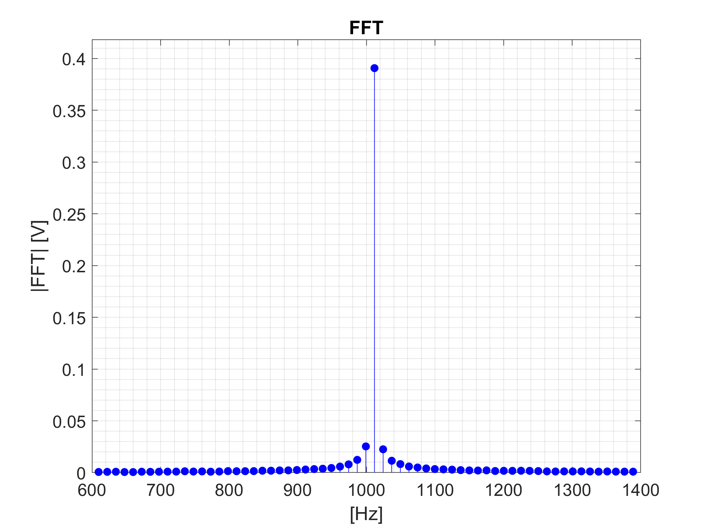

# matlab_utility

Questo repository contiene i codici **matlab** sviluppati e utilizzati durante i corsi di
laboratorio della laurea triennale in fisica a unitn. Lo scopo è sempre stato quello di incorporare tutte le funzionalità utili per l'analisi dati in delle funzioni e/o classi altamente customizzabili. Particolare riguardo è stato posto nella possibilità di generare grafici in maniera rapida e con uno stile consistente.

## functionFit

**functionFit** è una classe che permette di eseguire fit a un qualsiasi modello monodimensionale a N parametri. Per utilizzare la classe è necessario crearne un istanza dopodichè è possibile assegnarle i parametri e richiamare le funzioni di fit.

<details>
<summary> fit lineare </summary>

```matlab
% Istanza classe functionFit
fitter =  functionFit();
    
% Dati su cui eseguire il fit
fitter.datax = my_datax;
fitter.datay = my_datay;

% Incertezze sui dati
fitter.sigmax = my_sigmax;
fitter.sigmay = my_sigmay;

% Par è l'array contenente i parametri trovati, errpar il relativo array delle incertezze. 
[par, errpar, yfit, chi2norm] = fitter.linearFit();
```

</details>

<details>
<summary> fit non-lineare </summary>

```matlab
fitter =  functionFit();

fitter.datax = my_datax;
fitter.datay = my_datay;

fitter.sigmax = my_sigmax;
fitter.sigmay = my_sigmay;

% Fit a un modello sinusoidale
fitter.model = @(par, x) par(1)*sin(par(2)*x + par(3));

% Valori iniziali parametri
fitter.par = [0,0,0];

[par, errpar, yfit, chi2norm] = fitter.modelFit();
```

In questo caso specifico il fitter ha una libertà sul segno dell'ampiezza e il valore della fase. È possibile ridurre il range di valori per i parametri, forzando ad esempio l'ampiezza ai soli valori positivi tramite **upperBounds** e **lowerBounds**.

```matlab
fitter =  functionFit();

fitter.datax = my_datax;
fitter.datay = my_datay;

fitter.sigmax = my_sigmax;
fitter.sigmay = my_sigmay;

% Fit a un modello sinusoidale
fitter.model = @(par, x) par(1)*sin(par(2)*x + par(3));

% Valori iniziali parametri
fitter.par = [0,0,0];

% Limiti valori parametri
fitter.upperBounds = [inf inf 2*pi];
fitter.lowerBounds = [0 -inf 0];

[par, errpar, yfit, chi2norm] = fitter.modelFit();
```

</details>

<details>
<summary> plot grafici </summary>

Una tra le funzioni principali di questa classe è la possibilità di generare, oltre ai risultati del fit, anche il grafico dei residui. Il grafico generato è altamente customizzabile attraverso parametri di classe. Tutti i parametri sono elencati con nomi autoesplicativi nella sezione **arguments** della classe **functionFit**. Di seguito un esempio di un fit a una sinusoide smorzata.

```matlab
omega = 1000;

fitter = functionFit();

fitter.datax = my_datax;
fitter.datay = my_datay;

fitter.sigmax = my_sigmax;
fitter.sigmay = my_sigmay;

fitter.model = @(par, t) par(1)*cos((omega + par(2)) * t + par(3)).*exp(par(4)*t);

fitter.par = [0, 0, 0, 0];

fitter.upperBounds = [inf inf inf 0];
fitter.lowerBounds = [-inf -inf -inf -inf];

% Array contente unità di misura e nomi dei parametri da mostrare nella box
fitter.parnames = ["V_0","\delta{\omega_s}","\phi","\Upsilon"];
fitter.units = ["V","Hz","","s^{-1}"];

% Titolo grafico
fitter.name = "Smorzamento rapporto R1/R2=100";

% Label assi
fitter.labelx = "Tempo [s]";
fitter.labely = "Ampiezza [V]";
fitter.reslabely = "Scarti [V]";

% Posizione box parametri
fitter.boxPosition = [0.50 0.75];

% Funzione che esegue il fit, genera l'immagine e la salva in formato png
[par, errpar, yfit, chi2norm] = fitter.plotModelFit("plots/oscillazione_smorzata");
```


</details>

## fourierTransform

**fourierTransfrom** è una classe che permette di eseguire l'algoritmo FFT su un set di dati con calcolo automatico di ampiezze, frequenze e fasi.

<details>
<summary> trasformata di fourier </summary>

```matlab
% Istanza classe functionFit
f = fourierTransform();

% Dati su cui eseguire la trasformata
f.data = my_data;

% Incertezza sui dati
f.sigmaData = my_sigmaData;

% Intervallo di campionamento
f.dt = my_dt;

[frequencies, amps, phases, sigmaAmps, sigmaPhases] = ff.transform();
```

</details>

<details>
<summary> grafico trasformata </summary>

Il grafico generato è altamente customizzabile attraverso parametri di classe. Tutti i parametri sono elencati con nomi autoesplicativi nella sezione **arguments** della classe **fourierTransfrom**. Di seguito un esempio del grafico della trasformata di un segnale sinusoidale a pulsazione 1000Hz.

```matlab
f = fourierTransform();

f.data = my_data;

f.sigmaData = my_sigmaData;

f.dt = my_dt;

% Visualizza pulsazioni sull'asse x
ff.xAxisAsOmegas = 1;

% Limiti asse x
ff.xAxisLim = [600, 1400];

% Esegui trasformata e genera grafico delle ampiezze
[frequencies, amps, phases, sigmaAmps, sigmaPhases] = ff.plotAbsTransform("./plots/oscillatore_compensato_abs");

```



</details>
